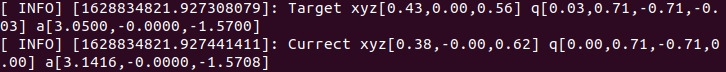
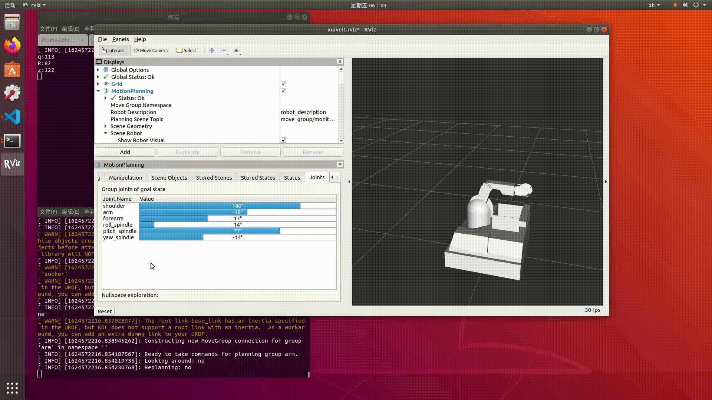

======================================
如何高效地调试TigerArm
======================================

在实际的项目中，会遇到形形色色的需求与目标，如何进行高效地调试也成了一个重要的问题。

在此，我先介绍对于一个完整动作的调试，它包括了如何数值化，可视化轨迹点的方法，与一些调整的经验。

下一章，将会介绍轨迹的优化，速度的增减，以及离线规划的需求等等。

数值化轨迹与轨迹点
========================================

对于一个动作的调试，获得正确的想要到达的目标值是最重要的第一步。但xyzrpy的值并不是肉眼就能设定的，因此我们会打印出当前末端执行器的位姿，作为轨迹点设置的参考

每个动作完成后都会输出这样两个INFO

.. Note:: Target指的是目标点的位姿，Currect指的是当前点的位姿，q是四元数表示的旋转角，a是欧拉角rpy表示的旋转角

轨迹点的数值化还没封装，而且输出的是关节角度，用的不多，这里先不谈

在Rviz中手动进行调试
==========================================

Rviz提供了MoveIt!运动规划的插件，使其可以在GUI上进行调试。进入Joints版块，拖动条条，然后进入Planning版块点击Plan & Execute即可将对应关节转到相应角度

.. warning:: 在Rviz插件中每一次进行手动调试都需要先点击左下角的reset再进行滚动条的拖动，以及注意Rviz中是不会打印出位姿信息的，如实在想获取，可通过任意键盘驱动后看Current信息获得

使用WASD进行位姿微调
=========================================

在原始的设定中，设置了wsad与WS六个按键，分别对应于末端执行器前后左右上下移动1cm，可以用于调试

关于TigerArm调试的一些经验
========================================

在经过了多次的尝试后，对于一个新的动作的调试我认为按以下步骤进行效率比较高:

- 通过Rviz里的手动拖拽滚动条使末端大致靠近目标

- 通过WASD微调使末端到达目标

- 记录此时终端打印出的位姿信息，将其记录于poses.yaml中，完成一个轨迹点的定位。如还需更高精度的调整可于yaml中手动修改后观察效果

.. note:: 注意一般rqy角度的调整都是在Rviz上完成的

